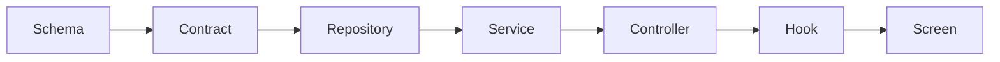

# Hedgehog Full-Stack App Core ⭐

### A Backend You Don't Have to Watch

Every AI coding tool can scaffold an app. Few can stop the backend from
rotting as it grows — auth logic scattered across routes, contracts
drifting from the client, schema changes nobody tested.

This core gives Hedgehog a backend that stays honest as it grows: one
opinionated stack, one enforced build order, and a phase gate that
blocks the next layer until the current one passes.



## What you get

- **NestJS + Drizzle + PostgreSQL** on the backend, **Next.js + ShadCN +
  Tailwind** on the frontend — decided once, not re-litigated per
  feature.
- **ts-rest contracts** so the client can't drift from the API: the
  types are shared, not duplicated.
- **TanStack Query hooks**, generated, not handwritten.
- **A commit gate** (lefthook + commitlint) that blocks a broken build
  from ever reaching your history.

## Built for real backend work

Reach for this core when the project needs authorization beyond
per-object rules, background jobs, scheduled work, webhooks, or
server-rendered pages — the things that make "just add a database" turn
into a maintenance job.

## Easy to install and use

Ask your agent:
*"Install Hedgehog and build me a [your app idea]"*

<details>
<summary>For your agent</summary>

```
npx @skyf0xx/hedgehog init
```

Hedgehog's planner selects this core automatically when your project
needs real backend logic — background jobs, webhooks, authorization
beyond row-level rules, or server-rendered pages. You can also request
it directly:

```
npx @skyf0xx/hedgehog init --ts-full-stack-app
```

Technical details: [ARCHITECTURE.md](ARCHITECTURE.md)
