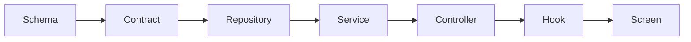

# Hedgehog Full-Stack App Core ⭐

### For: Well Architechted Full Stack Apps

Every AI coding tool can scaffold an app. Most let the backend rot as it
grows: auth logic scattered across routes, contracts drifting from the
client, schema changes nobody tested.

This core gives Hedgehog a backend that stays honest as it grows: one
opinionated stack, one enforced build order, and a phase gate that
blocks the next layer until the current one passes.



## What you get

- **NestJS + Drizzle + PostgreSQL** on the backend, **Next.js + ShadCN +
  Tailwind** on the frontend, locked in once so every feature reuses the
  same stack.
- **ts-rest contracts** so the client can't drift from the API: one
  shared type definition feeds both sides.
- **TanStack Query hooks**, generated straight from the contracts.
- **A commit gate** (lefthook + commitlint) that blocks a broken build
  from ever reaching your history.

## Built for production backend work

Reach for this core when the project needs authorization beyond
per-object rules, background jobs, scheduled work, webhooks, or
server-rendered pages. These are the features that turn "add a database"
into an ongoing maintenance job.

## Easy to install and use

Ask your agent:
*"Install Hedgehog and build me a [your app idea]"*

<details>
<summary>For your agent</summary>

```
npx @skyf0xx/hedgehog init
```

```
npx @skyf0xx/hedgehog init --ts-full-stack-app
```

Technical details: [ARCHITECTURE.md](ARCHITECTURE.md)
